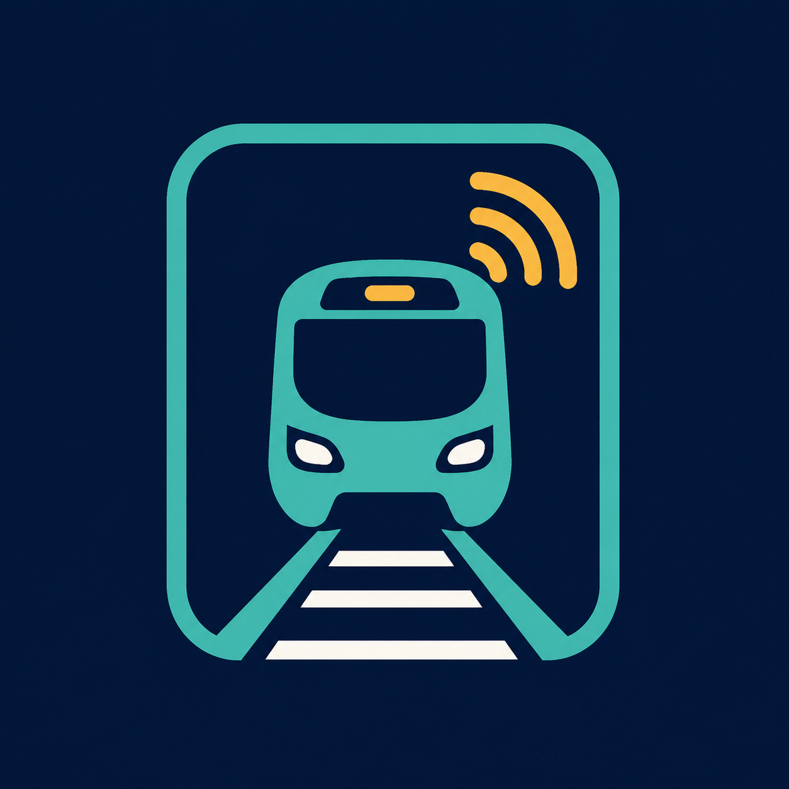
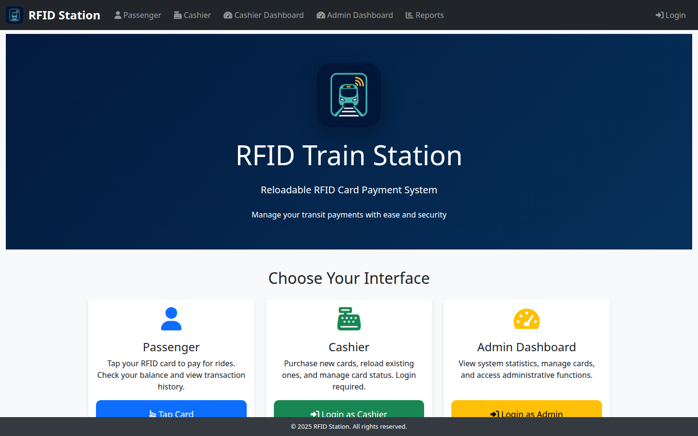
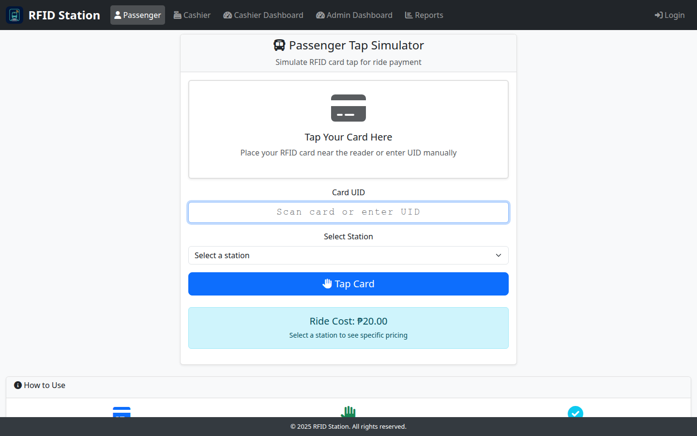
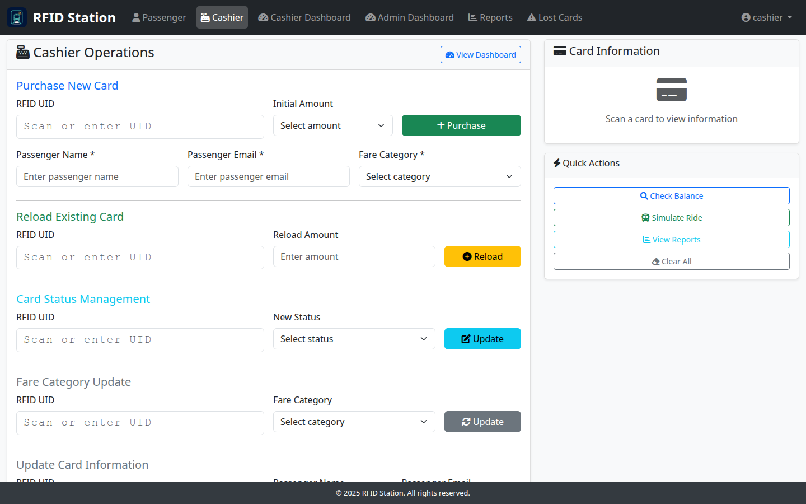
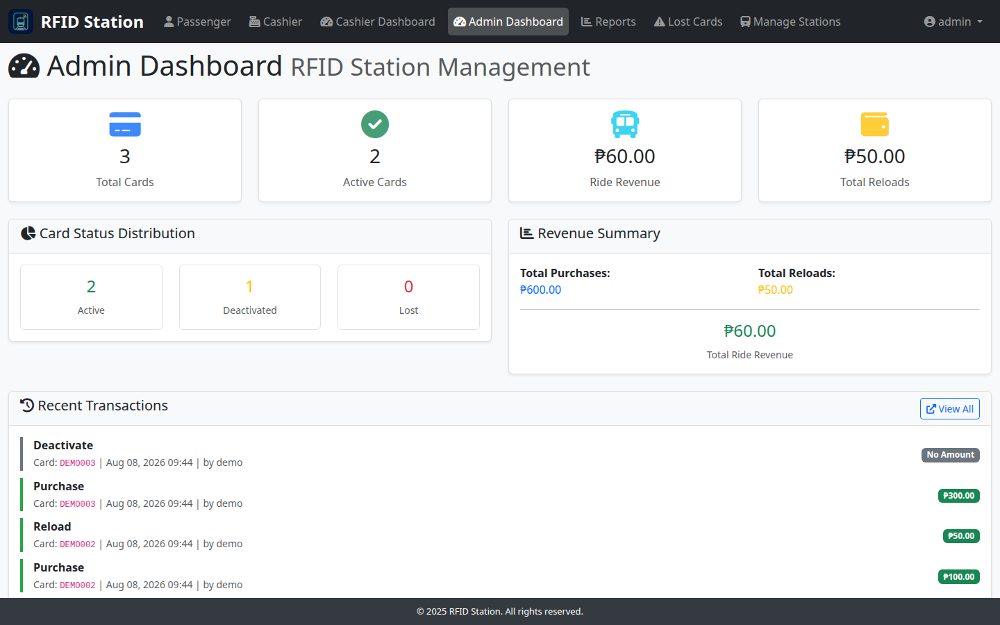
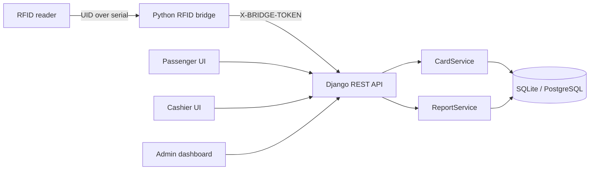

<p align="center">
  
</p>

<h1 align="center">RFID Train Station</h1>

<p align="center">
  A Django-based transit payment system for reloadable RFID cards, station-aware fares, passenger discounts, card lifecycle management, and operational reporting.
</p>

<p align="center">
  
  
  
  
  
</p>

## Application preview

<table>
  <tr>
    <td width="50%" align="center">
      <a href="docs/assets/screenshots/home.png"></a><br>
      <strong>Role-based home page</strong>
    </td>
    <td width="50%" align="center">
      <a href="docs/assets/screenshots/passenger.png"></a><br>
      <strong>Passenger tap interface</strong>
    </td>
  </tr>
  <tr>
    <td width="50%" align="center">
      <a href="docs/assets/screenshots/cashier.png"></a><br>
      <strong>Cashier operations</strong>
    </td>
    <td width="50%" align="center">
      <a href="docs/assets/screenshots/admin-dashboard.png"></a><br>
      <strong>Administrator dashboard</strong>
    </td>
  </tr>
</table>

## Why this project exists

Transit fare collection needs more than a balance field. A useful system must safely process concurrent taps, apply eligibility-based discounts, preserve an audit trail, separate passenger and staff workflows, and connect physical readers to a web backend.

RFID Train Station demonstrates that complete flow. A serial bridge reads card UIDs from an RFID reader and calls a Django REST API. The API delegates monetary operations to an atomic service layer, records every balance or lifecycle change, and serves dedicated passenger, cashier, and administrator interfaces.

## Core capabilities

- Purchase and reload RFID cards with a recorded transaction history.
- Charge station-specific fares using database transactions and row locking.
- Apply regular, student, senior, and PWD fare categories at tap time.
- Activate, deactivate, and mark cards as lost with neutral audit entries.
- Provide separate passenger, cashier, administrator, and Django Admin workflows.
- Generate card, transaction, and revenue reports.
- Connect a serial/USB RFID reader through a standalone Python bridge.
- Seed a complete synthetic demo for repeatable development and screenshots.

## Architecture



Balance-changing operations live in `CardService`, where `transaction.atomic()` and `select_for_update()` keep the balance update and audit entry together. For real concurrent turnstiles, PostgreSQL is recommended because SQLite does not provide equivalent row-level locking behavior.

See [Architecture](docs/ARCHITECTURE.md) for the component map, entity model, ride sequence, and security boundaries.

## Technology stack

| Area | Technology |
|---|---|
| Backend | Python, Django 5.2, Django REST Framework |
| UI | Django templates, Bootstrap 5, JavaScript |
| Development database | SQLite |
| Recommended production database | PostgreSQL |
| Reader integration | pyserial, requests |
| Browser capture | Selenium, Google Chrome |
| Production server dependency | Gunicorn |

## Quick start

### 1. Create an environment and install dependencies

```bash
git clone https://github.com/2Bol-afk/RFID_Trains_Station.git
cd RFID_Trains_Station
python -m venv .venv
source .venv/bin/activate
pip install -r rfid_station/requirements.txt
```

On Windows PowerShell, activate with `.venv\Scripts\Activate.ps1`.

### 2. Configure local environment variables

```bash
cd rfid_station
cp .env.example .env
set -a
source .env
set +a
```

The project reads environment variables directly with `os.environ`; creating `.env` alone does not load it. Use your shell, service manager, or an environment-loading tool in deployment.

| Variable | Purpose |
|---|---|
| `DJANGO_SECRET_KEY` | Django signing key; required to replace the development fallback |
| `DJANGO_DEBUG` | Set `False` outside local development |
| `DJANGO_ALLOWED_HOSTS` | Comma-separated permitted hosts |
| `RFID_BRIDGE_TOKEN` | Shared token sent by the hardware bridge |
| `RIDE_COST` | Default fare when no station is supplied |

### 3. Initialize and run

```bash
python manage.py migrate
python manage.py setup_system --create-users --create-demo-data
python manage.py runserver
```

Open `http://127.0.0.1:8000/`.

### Local demo accounts

These credentials are created only when `--create-users` is requested and are intended for local demonstration:

| Role | Username | Password |
|---|---|---|
| Cashier | `cashier` | `cashier123` |
| Administrator | `admin` | `admin123` |

Change or disable these accounts before any shared deployment.

## Roles and interfaces

| Interface | Canonical route | Access |
|---|---|---|
| Home | `/` | Public |
| Passenger tap simulator | `/passenger/` | Public demo interface |
| Cashier operations | `/cashier/` | Cashier group |
| Cashier dashboard | `/cashier-dashboard/` | Cashier group |
| Administrator dashboard | `/admin-dashboard/` | Admin group or superuser |
| Reports | `/reports/` | Cashier or admin |
| Lost-card management | `/lost-card-management/` | Cashier or admin |
| Station management | `/station-management/` | Admin |
| Django Admin | `/admin/` | Django staff permissions |

## API overview

Application API routes are available under `/api/`:

| Method | Route | Purpose |
|---|---|---|
| `POST` | `/api/cards/purchase/` | Issue a new card |
| `POST` | `/api/cards/{uid}/reload/` | Add card balance |
| `POST` | `/api/cards/{uid}/ride/` | Process an authenticated or bridge-token ride |
| `POST` | `/api/cards/{uid}/status/` | Change card lifecycle status |
| `GET` | `/api/cards/{uid}/balance/` | Staff balance lookup |
| `GET` | `/api/public/cards/{uid}/balance/` | Public demo balance lookup |
| `GET` | `/api/reports/data/` | JSON summary, revenue, or card report |
| `GET` | `/api/health/` | Administrator system health check |

See [API reference](docs/API.md) for authentication, request bodies, responses, and the full route list.

## RFID reader bridge

Run the bridge separately from the Django server:

```bash
cd rfid_station
python rfid_bridge.py \
  --serial /dev/ttyUSB0 \
  --api-url http://127.0.0.1:8000 \
  --token "$RFID_BRIDGE_TOKEN"
```

Use a Windows port such as `COM3` when appropriate. Each non-empty serial line is treated as a card UID. See [Hardware bridge](docs/HARDWARE.md) for flags, data flow, logging, and current constraints.

## Tests

```bash
cd rfid_station
python manage.py check
python manage.py makemigrations --check --dry-run
python manage.py test -v 2
```

The current suite covers deterministic demo setup, template branding, route separation, dashboard revenue rendering, and clean Django startup.

## Production considerations

This repository is a portfolio and demonstration system, not a production fare platform. Before deployment:

- Replace all development fallback secrets and demo credentials.
- Set `DJANGO_DEBUG=False`, configure allowed hosts, and serve exclusively over HTTPS.
- Use PostgreSQL for meaningful row-locking semantics under concurrent taps.
- Replace shared bridge tokens with rotated credentials and device-level controls.
- Remove or secure the public ride and transaction-history demo endpoints.
- Re-enable CSRF enforcement for session-authenticated mutation endpoints.
- Add rate limiting, tap idempotency, monitoring, backups, and a deployment-specific privacy review.

Known boundaries are detailed in [Architecture](docs/ARCHITECTURE.md#security-boundaries-and-current-limitations).

## Project team

RFID Train Station was developed as a four-person academic team project by:

- Roel Sadiang-Abay
- Lawrence James Paclibar
- Marco Batollo
- Dennis Olandio

For a personal portfolio, accompany this repository with a short explanation of the modules, decisions, and deliverables you personally owned.

## Documentation

- [Architecture](docs/ARCHITECTURE.md)
- [API reference](docs/API.md)
- [Hardware bridge](docs/HARDWARE.md)
- [Original project presentation](RFID%20Train%20Station.pptx)

## License

Licensed under the [MIT License](LICENSE).
