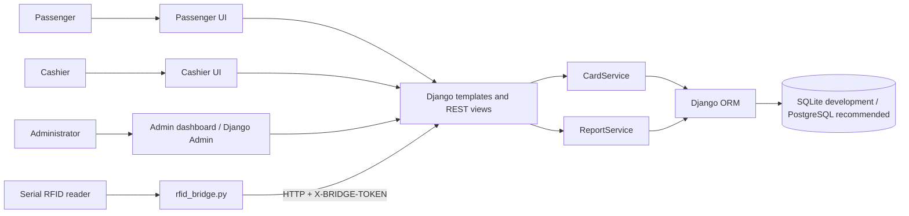
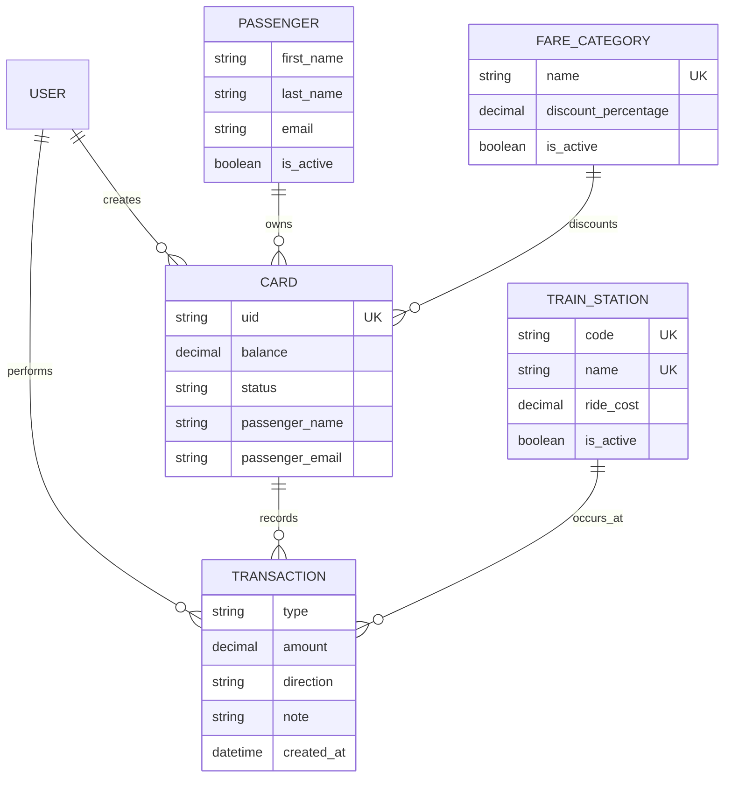
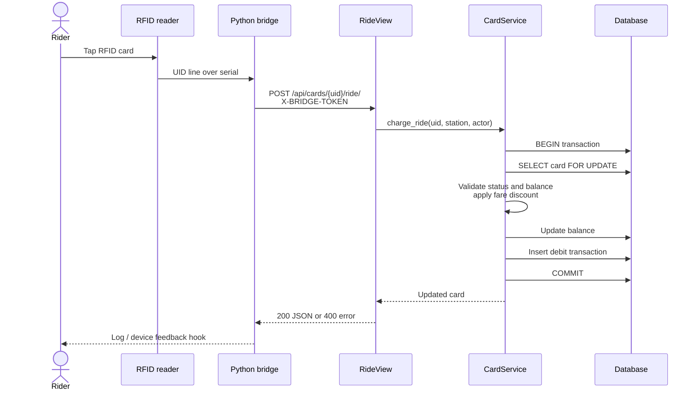

# Architecture

RFID Train Station combines a Django web application with a standalone serial-reader bridge. The application follows a simple layered design: views validate HTTP input and permissions, service classes own balance-changing business rules, models persist state, and report services aggregate operational data.

## System context

## Component responsibilities

| Component | Location | Responsibility |
|---|---|---|
| Project configuration | `rfid_station/rfid_station/` | Settings, top-level URLs, WSGI, and ASGI |
| Domain models | `rfid_station/cards/models.py` | Cards, passengers, fares, stations, and audit transactions |
| Business services | `rfid_station/cards/services.py` | Purchase, reload, ride, status, and passenger-information operations |
| HTTP views | `rfid_station/cards/views.py` | Template pages, request validation, permissions, and response mapping |
| Serializers | `rfid_station/cards/serializers.py` | DRF input validation and JSON representation |
| Permissions | `rfid_station/cards/permissions.py` | Cashier, administrator, and bridge-token authorization |
| Reporting | `rfid_station/cards/reports.py` | Summary, revenue, card, and transaction aggregates |
| RFID bridge | `rfid_station/rfid_bridge.py` | Serial UID input and ride API requests |
| Templates | `rfid_station/cards/templates/` | Passenger, cashier, report, and dashboard interfaces |

## Data model

`Card.passenger_name` and `Card.passenger_email` support the direct purchase workflow. `Card.passenger` is an optional link to the fuller `Passenger` record.

## Ride-charge sequence

## Transaction and concurrency model

Purchases, reloads, rides, and lifecycle changes execute inside `transaction.atomic()`. Existing cards are selected with `select_for_update()` before their balance or status is changed. The corresponding `Transaction` row is created before the database transaction commits, keeping state and audit history together.

SQLite is appropriate for the local demonstration, but its locking behavior is not equivalent to PostgreSQL row locking. A deployment with multiple simultaneous readers should use PostgreSQL and add request idempotency so repeated reader/network attempts cannot charge twice.

## Authentication boundaries

- Django session authentication supports the browser interfaces.
- Basic authentication remains enabled globally for DRF clients.
- Cashier and admin groups protect staff endpoints.
- The bridge ride endpoint accepts the shared `X-BRIDGE-TOKEN` header.
- Passenger demo endpoints intentionally allow unauthenticated balance, transaction, and ride operations.

## Security boundaries and current limitations

The current implementation is suitable for demonstration, not public fare collection:

1. `/api/public/cards/{uid}/ride/` allows an unauthenticated caller to deduct a fare when a station is supplied.
2. `/api/public/cards/{uid}/transactions/` exposes recent card activity to anyone who knows the UID.
3. Session-authenticated mutation views use a CSRF-exempt authentication class.
4. Development fallbacks exist for Django's secret key, debug mode, and the bridge token.
5. `IsAdminOnly` treats any Django staff user as an application administrator.
6. The bridge's preliminary balance request targets a staff-protected endpoint; only the ride POST accepts the bridge token.
7. There is no tap idempotency key, device registry, rate limit, or automated retry reconciliation.
8. Serial input is trusted as a complete UID line and is not cryptographically authenticated by the card.

A production design should remove public mutations, define passenger authentication or privacy-preserving lookup, require CSRF for browser sessions, use per-device credentials, rotate secrets, add idempotency, and perform a dedicated threat model.

## Deployment shape

For a production-style deployment, run Django behind HTTPS and a reverse proxy, serve static assets separately, use PostgreSQL, run the bridge as a supervised process on each reader host, and centralize logs and health monitoring. The checked-in settings currently configure SQLite only; PostgreSQL is a recommendation rather than an implemented environment profile.
